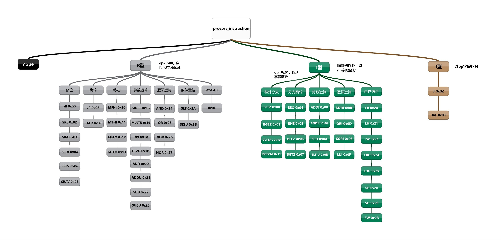
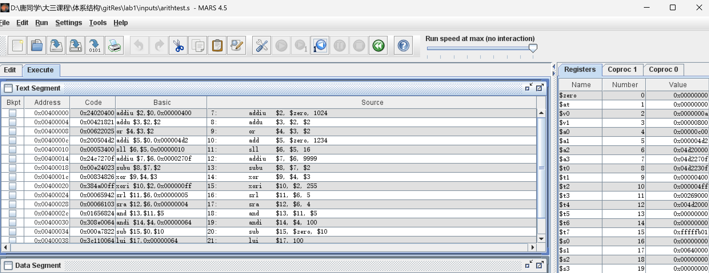

# lab1: Instruction-Level MIPS Simulator
## 总体设计
本次实验主要完善了Simulation Routine，实现了sim.c下的process_instruction函数。  

process_instruction函数的主要功能如下：
- 根据当前状态的PC，获取指令
- 调整PC
- 解析指令
- 根据指令类型进行分发处理

对实验所要求实现的指令做了如下分类：  


不同类型的指令，用于进行区分的字段不同：在解析指令时首先根据其opcode得到其属于哪一类指令，再在此类中依据特定字段进行分发处理。  
具体看如下代码，根据不同的opcode将指令区分为不同的类别，如R型、I型等，接着调用不同类别的处理函数进行分发处理。

```c
// 根据opcode分情况处理指令
if(instruction == 0)
    nop();
else if (opcode == 0x00)
    r_ins(rs, rt, rd, shamt, funct);
else if (opcode == 0x01)
    i_ins_branch_rt(rs, rt, immediate);
else if (opcode == 0x02 || opcode == 0x03)
    j_ins(opcode, address);
else
    i_ins(opcode, rs, rt, immediate);
```

分发处理的逻辑并不复杂，每个类别定义一个处理函数，根据相应的字段进行区分，再调用指令对应的函数进行处理。  
以R型指令为例，定义`r_ins`函数，根据funct字段进行`switch`分发，调用对应的指令函数。

```C
// 指令分发处理
void r_ins(uint8_t rs, uint8_t rt, uint8_t rd, uint8_t shamt, uint8_t funct){
    switch (funct)
    {
    // 移位指令
    case SLL:
        sll(rt, rd, shamt);
        break;
    case SRL:
        srl(rt, rd, shamt);
        break;
    case SRA: 
        sra(rt, rd, shamt);
        break;
    case SLLV:
        sllv(rs, rt, rd);
        break;
    case SRLV:
        srlv(rs, rt, rd);
        break;
    case SRAV:
        srav(rs, rt, rd);
        break;
    // 跳转指令
    case JR:
        jr(rs);
        break;
    case JALR:
        jalr(rs, rd);
        break;
    ...
    }
}
```


## R型指令
所有的R型指令opcode均为 **000000(SPECIAL)**，在R型指令的分发函数中，根据不同的**funct字段**进行区分。  
为了逻辑上的清晰，我对R型指令进行了简单的归类，分为**移位指令、跳转指令、移动指令、算数指令、逻辑指令、比较指令**。上述顺序也即是funct字段的顺序。  

具体指令的函数实现，是根据所学知识，并结合了MIPS R4000 User Manual和查阅资料得到的。具体见[代码](https://github.com/easymoneysnipertang/ComputerArchitecture/blob/master/lab1/src/mips_ins.c)，不在报告中赘述。    


## 特殊I型
特殊I型指令是指opcode为 **000001(REGIMM)** 的指令，包括 **bgez、bgezal、bltz、bltzal**。  
这些指令虽然和其他I型指令一样，有一个16位的立即数字段，但其opcode字段均为000001，用于区分的字段是rt字段，因此单独列出。


## I型指令
I型指令的opcode均为 **000xxx**，其中xxx为不同的值，用于区分不同的指令。  
同R型指令一样，我对I型指令进行了简单的归类，分为**分支跳转、算数运算、逻辑运算、内存访问**。上述顺序也即是opcode字段的顺序。  
 
值得一提的是，在实现addiu指令时，立即数为16位，需要对其进行拓展，我因为考虑到是unsigned，所以采用的是**0扩展**。但在查阅手册时，发现如下一段话：  
> The only difference between this instruction and the ADDI instruction is that ADDIU never causes an overflow exception.

故需要采用**符号扩展**。但简单的使用`int32_t`进行强制类型转换经过测试发现，并没有达到预期效果，因此实现上采用了如下不太优雅的方式：  
```c
void addiu(uint8_t rs, uint8_t rt, uint16_t imm){
    // 无符号加法，溢出时不报错
    if(rt != 0){  // 目标寄存器不能为0
        int32_t imm32 = imm > 0x7FFF? imm | 0xFFFF0000: imm;
        NEXT_STATE.REGS[rt] = CURRENT_STATE.REGS[rs] + imm32;
    }
}
```
另外lb、lh指令需要符号拓展，也使用了以上的方式。


## J型指令
J型指令仅有两条：**j、jal**，其opcode分别为000010、000011。  
在实现时，也曾犯过错误：  
之前对PC加四的操作一直是在`process_instruction`函数的最后进行的，这对beq等分支跳转指令没有影响，但对于j、jal指令，会导致PC混乱。  
即使在j、jal指令的处理函数中，对PC减四，仍然存在问题：因为指令是将`CURRENT_STATE.PC`与目标地址进行拼接，极端情况仍然有问题。  
当然如上问题也可以通过继续打补丁修改，但这样的实现**不够优雅**。结合了书上CPU结构图后，将PC加四的操作放在取指操作后，这样就不会出现上述问题。


## 实验验证
实验验证环节，由于所给的asm2hex脚本缺少spim相关包，使用Mars将汇编代码转换为机器码。  
> MARS is a lightweight interactive development environment (IDE) for programming in MIPS assembly language, intended for educational-level use with Patterson and Hennessy’s Computer Organization and Design.

除了使用Mars将汇编代码转换为机器码，还可以使用Mars进行仿真，进行单步调试，查看寄存器、内存等信息，方便与自己所实现的sim进行比照。  


实验测试和debug过程记录在了[仓库](https://github.com/easymoneysnipertang/ComputerArchitecture/tree/master/lab1)的log.md中。
