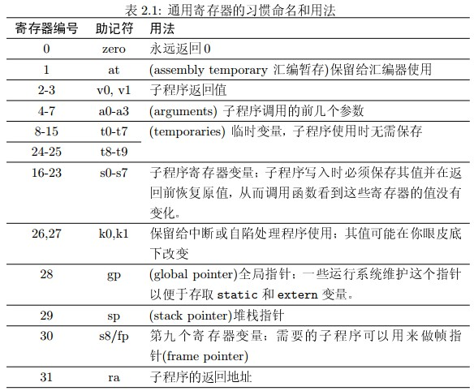

# 测试记录
MIPS寄存器对照：  



## addiu
```
__start:	addiu $v0, $zero, 10
		addiu $t0, $zero, 5
		addiu $t1, $t0, 300
		addiu $t2, $zero, 500
		addiu $t3, $t2, 34
		addiu $t3, $t3, 45
		syscall
```

> Read 7 words from program into memory  

代码段从0x00400000开始，用mdump可以看到七条指令被放进去了  
1. 10加到2号寄存器  
2. 5加到8号寄存器  
3. t0+300，305=0x131  
4. t2置500=0x1f4  
5. t3=t2+34=0x1f4+0x22=0x216  
6. t3=t3+45=0x216+0x2d=0x243  
7. syscall退出程序  

验证无误

## arithtest
```
main:   
        addiu   $2, $zero, 1024
        addu    $3, $2, $2
        or      $4, $3, $2
        add     $5, $zero, 1234
        sll     $6, $5, 16
        addiu   $7, $6, 9999
        subu    $8, $7, $2
        xor     $9, $4, $3
        xori    $10, $2, 255
        srl     $11, $6, 5
        sra     $12, $6, 4
        and     $13, $11, $5
        andi    $14, $4, 100
        sub     $15, $zero, $10
        lui     $17, 100
        addiu   $v0, $zero, 0xa
        syscall
```

1. addiu: 1024加到2号寄存器, $2=1024=0x400
2. addu: $3=2048=0x800
3. or: $4=2048|1024=3072=0xc00
4. add: $5=1234=0x4d2
5. sll: $6=1234<<16=0x4d20000
6. addiu: $7=0x4d20000+9999=0x4d2270f
7. subu: $8=0x4d2270f-1024=0x4d2230f
8. xor: $9=0xc00^0x800=0x400
9. xori: $10=0x400^255=0x4ff
10. srl: $11=0x4d20000>>5=0x269000
11. sra: $12=0x4d20000>>4=0x004d2000
12. and: $13=0x269000&0x4d2=0
13. andi: $14=0xc00&100=0
14. sub: $15=0-0x4ff=-1279=0xfffffb01
15. lui: $17=100<<16=0x640000
16. addiu: $v0=$2=10=0xa

没问题

## brtest0
```
main:
        addiu $v0, $zero, 0xa
l_0:    
        addiu $5, $zero, 1
        j l_1
        addiu $10, $10, 0xf00
        ori $0, $0, 0
        ori $0, $0, 0
        addiu $5, $zero, 100
        syscall        
l_1:
        bne $zero, $zero, l_3
        ori $0, $0, 0
        ori $0, $0, 0
        addiu $6, $zero, 0x1337
l_2:
        beq $zero, $zero, l_4
        ori $0, $0, 0
        ori $0, $0, 0
        # Should not reach here
        addiu $7, $zero, 0x347
        syscall
l_3:
        # Should not reach here
        addiu $8, $zero, 0x347
        syscall
l_4:
        addiu $7, $zero, 0xd00d
        syscall
```

1. addiu: $v0=$2=10=0xa
2. addiu: $5=1
3. j: 跳转到l_1
4. bne: $zero!=0，跳转到l_3，不会跳转，pc=0x00400020
5. ori: $0=0
6. ori: $0=0
7. addiu: $6=0x1337
8. beq: $zero==0，跳转到l_4，pc=0x00400048
9. addiu: $7=0xd00d  0x24080347

有问题！

## memtest
```
main:
        #;;  Set a base address
        lui    $3, 0x1000

        addiu  $5, $zero, 255
        add    $6, $5, $5
        add    $7, $6, $6
        addiu  $8, $7, 30000
        
        #;; Place a test pattern in memory
        sw     $5, 0($3)
        sw     $6, 4($3)
        sw     $7, 8($3)
        sw     $8, 12($3)

        lw     $9,  0($3)
        lw     $10, 4($3)
        lw     $11, 8($3)
        lw     $12, 12($3)

        addiu  $3, $3, 4
        sw     $5, 0($3)
        sw     $6, 4($3)
        sw     $7, 8($3)
        sw     $8, 12($3)

        lw     $13,  -4($3)
        lw     $14,  0($3)
        lw     $15,  4($3)
        lw     $16,  8($3)
               
        #;; Calculate a "checksum" for easy comparison
        add    $17, $zero, $9
        add    $17, $17, $10
        add    $17, $17, $11
        add    $17, $17, $12
        add    $17, $17, $13
        add    $17, $17, $14
        add    $17, $17, $15
        add    $17, $17, $16
        
        #;;  Quit out 
        addiu $v0, $zero, 0xa
        syscall
```

1. lui: $3=0x10000000
2. addiu: $5=255=0xff
3. add: $6=510=0x1fe
4. add: $7=1020=0x3fc
5. addiu: $8=31020=0x792c
6. sw: 0x10000000=0xff
7. sw: 0x10000004=0x1fe
8. sw: 0x10000008=0x3fc
9. sw: 0x1000000c=0x792c
10. lw: $9=0xff
11. lw: $10=0x1fe
12. lw: $11=0x3fc
13. lw: $12=0x792c
14. addiu: $3=0x10000004
15. sw: 0x10000004=0xff
16. sw: 0x10000008=0x1fe
17. sw: 0x1000000c=0x3fc
18. sw: 0x10000010=0x792c
19. lw: $13=0xff
20. lw: $14=0xff
21. lw: $15=0x1fe
22. lw: $16=0x3fc
23. add8: $17=0xff+0x1fe+0x3fc+0x792c+0xff+0xff+0x1fe+0x3fc=0x881d
    
验证无误

## ## memtest1
```
main:
        #;;  Set a base address
        lui    $3, 0x1000

        addiu  $5, $zero, 0xcafe
        addiu  $6, $zero, 0xfeca
        addiu  $7, $zero, 0xbeef
        addiu  $8, $zero, 0xefbe
                
        #;; Place a test pattern in memory
        sb     $5, 0($3)
        sb     $6, 1($3)
        sb     $7, 6($3)
        sb     $8, 7($3)

        lbu     $9,  0($3)
        lbu     $10, 1($3)
        lb      $11, 6($3)
        lb      $12, 7($3)

        addiu  $3, $3, 4
        sh     $5, 0($3)
        sh     $6, 2($3)
        sh     $7, 4($3)
        sh     $8, 6($3)

        lhu     $13,  0($3)
        lhu     $14,  2($3)
        lh     $15,  4($3)
        lh     $16,  6($3)
               
        #;; Calculate a "checksum" for easy comparison
        add    $17, $zero, $9
        add    $17, $17, $10
        add    $17, $17, $11
        add    $17, $17, $12
        add    $17, $17, $13
        add    $17, $17, $14
        add    $17, $17, $15
        add    $17, $17, $16
        
        #;;  Quit out 
        addiu $v0, $zero, 0xa
        syscall
```

1. lui: $3=0x10000000
2. addiu: $5=0xcafe
3. addiu: $6=0xfeca
4. addiu: $7=0xbeef
5. addiu: $8=0xefbe
6. sb: 0x10000000=0xfe

有问题！